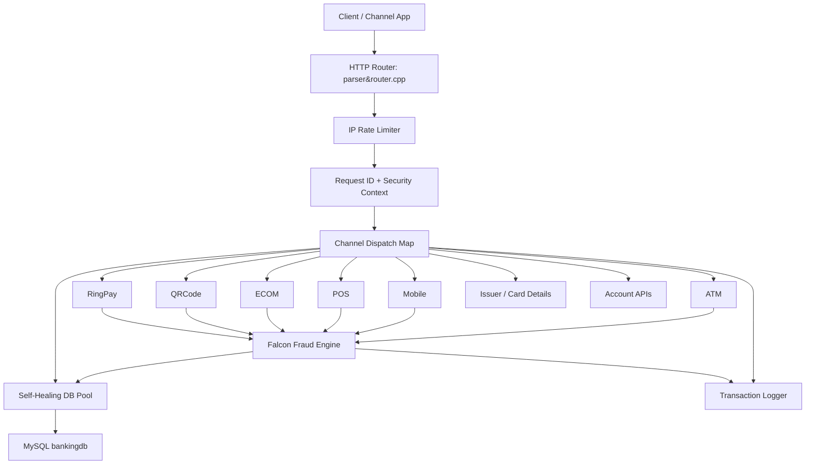

# Payment Switching Engine

A C++20 banking and card payment switching engine that routes multiple digital payment channels through one HTTP API. The engine supports account management, card issuance, ATM, POS, ECOM, mobile banking, QR payments, RingPay contactless payments, Falcon fraud monitoring, structured transaction logs, health checks, and Prometheus-style metrics.

The project is built as a high-throughput backend service using `cpp-httplib`, `nlohmann::json`, MySQL Connector/C++ X DevAPI, OpenSSL, a self-healing database connection pool, and per-account locking for safer concurrent balance updates.

## Table of Contents

- [Project Goals](#project-goals)
- [Core Features](#core-features)
- [Architecture](#architecture)
- [Request Lifecycle](#request-lifecycle)
- [HTTP Endpoints](#http-endpoints)
- [Payment Channels](#payment-channels)
- [Falcon Fraud Engine](#falcon-fraud-engine)
- [Security Model](#security-model)
- [Structured Logging](#structured-logging)
- [Database Design](#database-design)
- [Build and Run](#build-and-run)
- [Environment Variables](#environment-variables)
- [API Examples](#api-examples)
- [Error Codes](#error-codes)
- [Project Structure](#project-structure)
- [Production Notes](#production-notes)

## Project Goals

This project simulates the core responsibilities of a banking payment switch:

- Receive transaction requests from multiple channels.
- Normalize requests into one routing format.
- Validate card, PIN, account, balance, limits, and fraud rules.
- Update account balances safely.
- Store channel-specific transaction records.
- Maintain a central master transaction registry.
- Return consistent JSON responses with request correlation IDs.
- Generate readable logs for operations, debugging, and audit tracing.

## Core Features

- Unified router: one `/transaction/initiate` endpoint routes by `channelId`.
- Direct account APIs: add, view, freeze, unfreeze, and list accounts.
- Channel coverage: ATM, Mobile, POS, ECOM, QRCode, RingPay, Issuer, Card Details.
- Falcon fraud detection: velocity checks, same-second duplicate checks, amount spike detection, and local AI-style security scoring.
- Threaded HTTP server: 1000 worker threads with bounded queue back-pressure.
- Database pool: 30 MySQL X DevAPI sessions with stale-session healing.
- Per-account locking: prevents race conditions during concurrent credit/debit updates.
- Request tracing: every request receives `X-Request-ID` and `X-Transaction-UUID`.
- Structured logs: request summaries, function errors, line numbers, and self-healing log files.
- Metrics and health: `/health`, `/status`, and `/metrics` endpoints.
- PAN encryption: AES-256-GCM service for encrypted PAN transport.
- PIN verification: deterministic HMAC-SHA256 based PIN derivation, no PIN lookup table.

## Architecture



## Request Lifecycle

1. Client sends an HTTP request to `/transaction/initiate` or a direct account endpoint.
2. Router applies CORS headers and generates a UUID request ID.
3. Router enforces IP rate limiting: 200 requests per minute per IP.
4. Router attaches internal context:
   - `_correlationUuid`
   - `_channelId`
   - `_securityContext`
5. Security headers are captured in compact form for Falcon scoring.
6. Router dispatches the request to the correct channel function.
7. Channel validates request fields, card details, account state, PIN, balance, and limits.
8. Falcon fraud engine runs before money movement.
9. Account locks protect balance changes from race conditions.
10. Channel writes to its transaction table and the central `transactions` table.
11. Response is returned with `requestId` and `transactionUuid`.
12. Structured log lines are written with channel, UUID, status, duration, and errors.

## HTTP Endpoints

| Method | Endpoint | Purpose |
| --- | --- | --- |
| `POST` | `/transaction/initiate` | Unified payment and channel router |
| `POST` | `/account/add` | Create a new account |
| `POST` | `/account/details` | Fetch one account |
| `POST` | `/account/freeze` | Freeze an account |
| `POST` | `/account/unfreeze` | Unfreeze an account |
| `POST` | `/account/list` | List accounts with pagination |
| `GET` | `/health` | Basic service and DB pool health |
| `GET` | `/status` | Runtime counters, active requests, DB pool status |
| `GET` | `/metrics` | Prometheus-style counters |
| `OPTIONS` | Multiple routes | CORS preflight |

## Payment Channels

All payment channels can be called through `/transaction/initiate`:

```json
{
  "channelId": "POS",
  "data": {
    "transactionType": "PURCHASE"
  }
}
```

### Channel Summary

| Channel ID | Implementation | Main Operations | Notes |
| --- | --- | --- | --- |
| `ATM` | `atm.cpp` | `WITHDRAWAL`, `DEPOSIT` | Validates encrypted card PAN, expiry, optional CVV, PIN, daily limits, and Falcon rules. |
| `MOBILE` | `mobile.cpp` | `FUND_TRANSFER` | Transfers from debit account to credit account, supports PAN+PIN or debit account input, validates hourly and daily limits. |
| `POS` | `pos.cpp` | `PURCHASE`, `REFUND` | Handles merchant terminal purchases and original transaction refunds. |
| `ECOM` | `ecom.cpp` | `PURCHASE`, `REFUND` | Handles online purchase/refund, card or direct account flow, domestic/international scope. |
| `QRCODE` | `qrcode.cpp` | `PURCHASE`, `REFUND` | Parses QR data for merchant, terminal, currency, and amount, then processes account debit/refund. |
| `RINGPAY` | `ringpay.cpp` | Contactless payment | Uses wearable token, device ID, merchant limit, daily limit, risk score, and auto reversal on simulated network failure. |
| `ISSUER` | `issue.cpp` | Issue card | Generates Luhn-valid PAN, expiry, CVV, encrypted PAN, card type, and priority. |
| `CARD_DETAILS` | `issue.cpp` | Card lookup | Decrypts encrypted PAN and returns card details. Restrict this endpoint in production. |
| `ADD_ACCOUNT` | `account.cpp` | Add account | Alternative route for account creation through the unified router. |
| `ACCOUNT_DETAILS` | `account.cpp` | Account lookup | Alternative route for account details through the unified router. |
| `FREEZE_ACCOUNT` | `account.cpp` | Freeze account | Blocks future transactions by setting `is_frozen`. |
| `UNFREEZE_ACCOUNT` | `account.cpp` | Unfreeze account | Restores account usability. |
| `LIST_ACCOUNTS` | `account.cpp` | List accounts | Supports `limit` and `offset`. |

### Channel Limits

| Channel | Limit |
| --- | --- |
| ATM withdrawal | 5000 per day |
| ATM deposit | 10000 per day |
| Mobile single transaction | 2000 |
| Mobile hourly total | 2000 |
| Mobile daily total | 10000 |
| POS single transaction | 50000 |
| RingPay single transaction | 2000 |
| RingPay daily total | 5000 |
| RingPay merchant daily total | 3000 |

### Channel Timeouts

| Channel | Timeout |
| --- | --- |
| ATM | 6 seconds |
| Mobile | 6 seconds |
| POS | 5 seconds |
| ECOM | 5 seconds |

## Falcon Fraud Engine

Falcon is the fraud management layer used before allowing payment movement. It writes declined fraud events to `transaction_falcon` and links them into the master `transactions` table.

### Rules

| Rule | Description |
| --- | --- |
| Same-second duplicate | Declines a duplicate transaction for the same account within 1 second. |
| Per-channel velocity | Declines if a channel exceeds 5 transactions in 60 seconds. |
| Cross-channel velocity | Detects rapid multi-channel activity across ATM, Mobile, POS, ECOM, QRCode, and RingPay. |
| Amount spike | Declines if amount is greater than 3x the 7-day average transaction amount. |
| Local AI security score | Scores malware, tamper, root, emulator, proxy/VPN, attack tool user-agent, payload markers, and external risk headers. |

### Security Headers Used by Falcon

These headers can be sent by a mobile app, API gateway, WAF, device integrity provider, or fraud orchestration layer:

| Header | Meaning |
| --- | --- |
| `X-Device-Integrity` | Device integrity result such as `pass`, `fail`, `low`, or `compromised`. |
| `X-App-Signature-Valid` | Whether the app signature is valid. |
| `X-Device-Binding-Valid` | Whether the device is bound to the customer/session. |
| `X-Device-Trust-Score` | Numeric device trust score. |
| `X-Malware-Detected` | Malware detection flag. |
| `X-Rooted-Device` | Rooted or jailbroken device signal. |
| `X-Debugger-Detected` | Runtime debugger signal. |
| `X-Proxy-Detected` | Proxy signal. |
| `X-VPN-Detected` | VPN signal. |
| `X-Falcon-Risk-Score` | External risk score from another fraud system. |

If Falcon's local risk score reaches `85`, the transaction is declined.

## Security Model

### PAN Handling

- Incoming transaction requests use encrypted PAN values.
- `PANEncryptionService` uses AES-256-GCM with:
  - 32-byte key
  - 12-byte IV
  - 16-byte authentication tag
  - Base64 transport format
- Issuer returns `encryptedPan` so clients can use it in later transaction requests.

Important: the current schema keeps `cards.pan` for lookup and demo workflows. In production, replace this with tokenization, HSM-backed key management, and stricter card detail access controls.

### PIN Handling

- PIN is not stored in a database table.
- `PINService` derives a deterministic PIN from PAN using HMAC-SHA256 and custom mixing.
- Verification regenerates the expected PIN and compares it with the input.

Important: the current secret key is embedded for development. Production should move keys to a secure vault or HSM.

### Concurrency and Balance Safety

- `AccountLockManager` serializes updates per account.
- Credit operations have priority over debit operations.
- Database transactions are used for balance updates and transaction inserts.
- Same-account concurrent issuance is serialized so card priority remains correct.

## Structured Logging

`TransactionLogger` writes readable transaction logs to:

```text
bin/debug/log
```

Log records include:

- Timestamp
- Level
- UUID
- Channel
- Event
- Message
- Thread ID
- Function name
- Error source file, line, and C++ function for failures

The logger is designed to recover when the active log file or log directory is deleted. It retries writes up to 3 times, creates a new log file when needed, and keeps log volume controlled by default.

Set the log level with:

```bash
export TRANSACTION_LOG_LEVEL=INFO
```

Supported levels: `TRACE`, `DEBUG`, `INFO`, `WARN`, `ERROR`.

## Database Design

Primary schema file:

```text
Create DB.sql
```

Main tables:

| Table | Purpose |
| --- | --- |
| `accounts` | Customer accounts, balance, freeze status, country, currency. |
| `currency` | Currency master table. |
| `cards` | Card PAN, masked PAN, encrypted PAN, scheme, expiry, CVV, priority, status. |
| `ringpay_tokens` | RingPay wearable/contactless tokens. |
| `transaction_atm` | ATM deposits and withdrawals. |
| `transaction_mobile` | Mobile fund transfers. |
| `transaction_pos` | POS purchases and refunds. |
| `transaction_ecom` | E-commerce purchases and refunds. |
| `transaction_qrcode` | QR purchases and refunds. |
| `transaction_ringpay` | RingPay contactless transactions and reversals. |
| `transaction_falcon` | Fraud decline records. |
| `transactions` | Master registry linking all channel transaction records. |

## Build and Run

### Requirements

- C++20 compiler
- CMake 3.15 or newer
- MySQL Server with X Plugin enabled
- MySQL Connector/C++ with X DevAPI
- OpenSSL 3
- Threads library

The current `CMakeLists.txt` is configured for Homebrew paths on macOS:

```text
/opt/homebrew/include
/opt/homebrew/lib
/opt/homebrew/Cellar/mysql-connector-c++/9.5.0
/opt/homebrew/opt/openssl@3
```

Adjust these paths if your system uses different install locations.

### Build

```bash
cmake -S . -B cmake-build-debug
cmake --build cmake-build-debug
```

### Run

```bash
./cmake-build-debug/BankingAPIServer
```

The server listens on:

```text
http://0.0.0.0:8080
```

## Environment Variables

| Variable | Default | Description |
| --- | --- | --- |
| `DB_HOST` | `localhost` | MySQL host |
| `DB_PORT` | `33060` | MySQL X Plugin port |
| `DB_USER` | `root` | Database user |
| `DB_PASS` | Development fallback in code | Database password |
| `DB_NAME` | `bankingdb` | Database name |
| `TRANSACTION_LOG_LEVEL` | `INFO` | Logger minimum level |

Example:

```bash
export DB_HOST=localhost
export DB_PORT=33060
export DB_USER=root
export DB_PASS='your-password'
export DB_NAME=bankingdb
export TRANSACTION_LOG_LEVEL=INFO
```

## API Examples

### Health

```bash
curl http://localhost:8080/health
```

### Add Account

```bash
curl -X POST http://localhost:8080/account/add \
  -H 'Content-Type: application/json' \
  -d '{
    "accountNumber": "AU1234567890",
    "balance": 10000.00,
    "countryCode": "AU",
    "currencyCode": "AUD",
    "isFrozen": false
  }'
```

### Issue Card

```bash
curl -X POST http://localhost:8080/transaction/initiate \
  -H 'Content-Type: application/json' \
  -d '{
    "channelId": "ISSUER",
    "data": {
      "accountNumber": "AU1234567890",
      "cardholderName": "Rohan Sakhare",
      "scheme": "MASTERCARD"
    }
  }'
```

Use `encryptedPan`, `expiry`, and `cvv` from the issue response in transaction requests.

### POS Purchase

```bash
curl -X POST http://localhost:8080/transaction/initiate \
  -H 'Content-Type: application/json' \
  -H 'X-Device-Integrity: pass' \
  -H 'X-App-Signature-Valid: true' \
  -H 'X-Device-Trust-Score: 95' \
  -d '{
    "channelId": "POS",
    "data": {
      "clientTxnId": "pos-1001",
      "transactionType": "PURCHASE",
      "merchantId": "MCH-POS-001",
      "terminalId": "TERM-7788",
      "location": "Sydney Mall",
      "amount": 100.00,
      "fee": 2.00,
      "currency": "AUD",
      "card": {
        "pan": "<encryptedPan>",
        "pin": "<generatedPin>",
        "expiry": "<expiry>",
        "cvv": "<cvv>"
      }
    }
  }'
```

### Mobile Fund Transfer

```bash
curl -X POST http://localhost:8080/transaction/initiate \
  -H 'Content-Type: application/json' \
  -d '{
    "channelId": "MOBILE",
    "data": {
      "clientTxnId": "mob-2001",
      "transactionType": "FUND_TRANSFER",
      "pan": "<encryptedPan>",
      "pin": "<generatedPin>",
      "creditAccount": {
        "accountNumber": "AU9988776655"
      },
      "amount": 200.00,
      "fee": 0.00,
      "deviceId": "DEVICE-8899",
      "mobileNumber": "9876543210"
    }
  }'
```

### Falcon Security Decline Test

```bash
curl -X POST http://localhost:8080/transaction/initiate \
  -H 'Content-Type: application/json' \
  -H 'X-Malware-Detected: true' \
  -d '{
    "channelId": "POS",
    "data": {
      "clientTxnId": "pos-risk-1",
      "transactionType": "PURCHASE",
      "amount": 100.00,
      "card": {
        "pan": "<encryptedPan>",
        "expiry": "<expiry>"
      }
    }
  }'
```

Expected result: Falcon declines the transaction before balance movement.

## Error Codes

| Error Code | Meaning |
| --- | --- |
| `ERR_INVALID_REQUEST` | Required input is missing or invalid. |
| `ERR_INVALID_AMOUNT` | Amount is not valid for this operation. |
| `ERR_INVALID_ENCRYPTED_PAN` | PAN decryption failed. |
| `ERR_INVALID_PIN` | PIN verification failed. |
| `ERR_CARD_NOT_FOUND` | Card was not found. |
| `ERR_INVALID_EXPIRY` | Expiry does not match card record. |
| `ERR_INVALID_CVV` | CVV does not match card record. |
| `ERR_CARD_INACTIVE` | Card is not active. |
| `ERR_ACCOUNT_NOT_FOUND` | Account does not exist. |
| `ERR_ACCOUNT_EXISTS` | Account already exists. |
| `ERR_ACCOUNT_FROZEN` | Account is frozen. |
| `ERR_INSUFFICIENT_FUNDS` | Balance is too low. |
| `ERR_SINGLE_LIMIT` | Single transaction limit exceeded. |
| `ERR_DAILY_LIMIT` | Daily transaction limit exceeded. |
| `ERR_HOURLY_LIMIT` | Mobile hourly transaction limit exceeded. |
| `ERR_RATE_LIMIT` | IP rate limit exceeded. |
| `ERR_TIMEOUT` | Channel processing exceeded timeout. |
| `ERR_FRAUD` | Falcon declined the transaction. |
| `ERR_DB` | Database error. |
| `ERR_EXCEPTION` | Internal exception. |

## Project Structure

```text
.
|-- parser&router.cpp          # HTTP server, routing, rate limiting, health, metrics
|-- Database.cpp               # Self-healing MySQL connection pool
|-- TransactionLogger.cpp      # Structured transaction logger
|-- falcon.cpp                 # Falcon fraud and AI-style risk scoring
|-- account.cpp                # Account create/read/freeze/list APIs
|-- issue.cpp                  # Card issuance and card details
|-- atm.cpp                    # ATM channel
|-- mobile.cpp                 # Mobile banking channel
|-- pos.cpp                    # POS channel
|-- ecom.cpp                   # E-commerce channel
|-- qrcode.cpp                 # QRCode channel
|-- ringpay.cpp                # RingPay contactless channel
|-- pin.cpp                    # PIN generation and verification
|-- panencrypted.cpp           # AES-256-GCM PAN encryption/decryption
|-- include/                   # Public headers and bundled libraries
|-- Create DB.sql              # Database schema
`-- CMakeLists.txt             # Build configuration
```

## Production Notes

Before using this outside development, harden the following areas:

- Move AES and PIN secrets to a vault, HSM, or environment-managed secret store.
- Replace plaintext `cards.pan` storage with tokenized or HSM-backed lookup.
- Restrict or remove the card details endpoint from public access.
- Add authentication and authorization for all endpoints.
- Use TLS termination or native HTTPS.
- Add idempotency enforcement for client transaction IDs.
- Add database migrations instead of manually edited SQL.
- Add unit/integration tests for all channels and Falcon rules.
- Add structured JSON logs if integrating with SIEM/observability platforms.
- Replace simulated RingPay network failure with real provider response handling.

## License

This repository currently does not include an open-source license file. Add a license before publishing or accepting external contributions.
